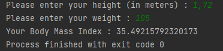

# Body Mass Index Calculation
* Take the user's height and weight values with Java and assign them to a variable. Calculate the user's 'Body Mass Index' value according to the formula below and print it on the screen
# **Formula**
* ***weight/ height * height***

# Output

