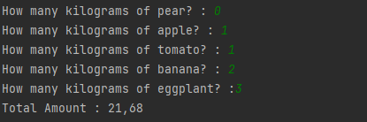

# Grocery Checkout Program
* Write a Java program that calculates the total amount based on the kilogram values of the products bought from a greengrocer by the users and displays it on the screen.

### Fruits and Prices per KG

* Pear: 2.14 TL
* Apple: 3.67 TL
* Tomato: 1.11 TL
* Banana: 0.95 TL
* Eggplant: 5.00 TL

* Example Output:

